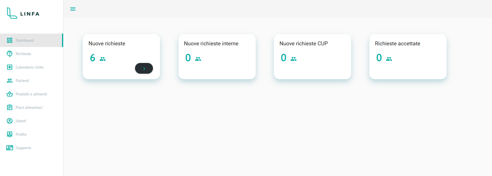
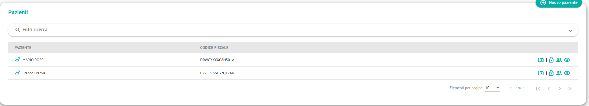

# Linfa Open 


Frontend applicativo per i reparti ospedalieri di nutrizione, realizzato con Angular 12 e Angular Material.

[](https://github.com/MEDIAM-SERVIZI-S-R-L/Linfa-Open)
[](https://angular.io/)
[](https://joinup.ec.europa.eu/collection/eupl/eupl-text-eupl-12)

## Descrizione

Linfa Open è un frontend web destinato ai reparti ospedalieri di nutrizione.

L’applicazione mette a disposizione dashboard operative con l’elenco delle visite da eseguire, la pianificazione degli appuntamenti e la gestione dettagliata della visita nutrizionale, inclusi:

- Anamnesi.
- Parametri clinici.
- Piano alimentare.
- Note della visita.

Il progetto è sviluppato da **MEDIAM SERVIZI S.R.L.** ed è destinato all’ambito sanitario e sociale. Il repository ufficiale è disponibile su [GitHub](https://github.com/MEDIAM-SERVIZI-S-R-L/Linfa-Open).

### Funzionalità principali

- Gestione PNRR.
- Gestione di PNRR, beneficiari e ASL.
- Dashboard operative.
- Interfacce responsive e accessibili.
- Componenti dell’interfaccia realizzati con Angular Material UI.

### Organizzazioni utilizzatrici

- strutture ospedaliere pubbliche e/o private
- ASL
- ASST

## Screenshots

### Login


### Dashboard



### Lista pazienti




## Tecnologie usate

| Tecnologia | Versione | Utilizzo |
|---|---:|---|
| Angular | 12 | Framework principale del frontend |
| Angular Material | Compatibile con Angular 12 | Libreria UI e componenti grafici |
| Node.js | 16 | Runtime e gestione degli strumenti di build |
| TypeScript | Definita dal progetto | Linguaggio di sviluppo Angular |
| HTML/CSS | Definita dal progetto | Struttura e stile dell’interfaccia |

La piattaforma di destinazione è il **web**. La lingua disponibile dichiarata nel progetto è l’italiano.

## Prerequisiti

Prima di procedere con l’installazione, assicurarsi di avere installato:

- [Node.js 16](https://nodejs.org/), come indicato nel file `publiccode.yml`.
- npm, normalmente incluso nell’installazione di Node.js.
- Git, per clonare il repository.

È consigliato utilizzare una versione LTS di Node.js 16 e verificare le versioni installate:

```bash
node --version
npm --version
```

## Installazione

Clonare il repository e accedere alla directory del progetto:

```bash
git clone https://github.com/MEDIAM-SERVIZI-S-R-L/Linfa-Open.git
cd Linfa-Open
```

Installare le dipendenze del progetto:

```bash
npm install
```

Se il progetto utilizza un file `package-lock.json` versionato e si desidera un’installazione riproducibile, è possibile usare:

```bash
npm ci
```

## Avvio in modalità sviluppo

Avviare il server di sviluppo Angular con:

```bash
npx ng serve
```

In alternativa, se lo script è definito nel `package.json`:

```bash
npm start
```

L’applicazione sarà normalmente disponibile all’indirizzo [http://localhost:4200/](http://localhost:4200/). Per rendere il server raggiungibile da altri dispositivi della rete locale:

```bash
npx ng serve --host 0.0.0.0
```

## Build di produzione

Per creare la build ottimizzata del frontend:

```bash
npx ng build --configuration production
```

In base alla configurazione del progetto Angular 12, i file generati saranno disponibili nella directory `dist/`.

Per una build standard, è possibile usare anche:

```bash
npx ng build
```

Prima della distribuzione verificare nel file `angular.json` il nome della directory di output e le eventuali configurazioni degli ambienti (`src/environments/`).

## Licenza

Il progetto è distribuito con licenza **EUPL-1.0** — European Union Public Licence, versione 1.0.

Per consultare il testo della licenza, visitare la [pagina ufficiale EUPL](https://joinup.ec.europa.eu/collection/eupl/eupl-text-eupl-12).

## Informazioni sul progetto

- Nome: Linfa Open.
- Suite applicativa: Linfa.
- Versione software: 1.8.0.3.
- Data di rilascio: 10 ottobre 2024.
- Stato di sviluppo: development.
- Tipo: applicazione web standalone.
- Organizzazione: [MEDIAM SERVIZI S.R.L.](https://mediamsolutions.it/).
- Documentazione e codice sorgente: [repository GitHub](https://github.com/MEDIAM-SERVIZI-S-R-L/Linfa-Open).
